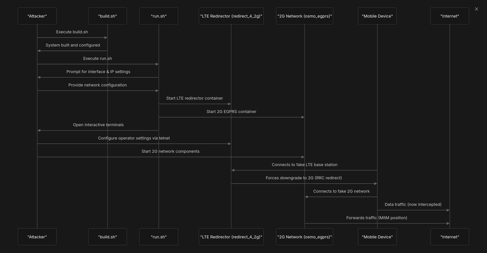

# Running the Attack

This page provides a comprehensive guide for executing the LTE redirection attack using the components previously set up in the [Setup and Installation](2-setup-and-installation.md) section. The document covers the process from startup to completion, including network configuration, component initialization, and the step-by-step procedure to successfully redirect mobile devices from LTE to a controlled 2G network.

## Attack Flow Overview

The LTE redirection attack follows a specific sequence that begins with system initialization and ends with mobile devices being redirected to a controlled 2G network where traffic can be monitored and manipulated.



## Preparing to Run the Attack

Before executing the attack, ensure that you have:

1. Completed the setup and installation process described in the [Setup and Installation](2-setup-and-installation.md) page
2. Connected and properly configured both SDR devices
3. Root/sudo privileges for executing the scripts

### Component Architecture During Attack Execution

## Running the Attack

The attack is executed by running the main control script, which orchestrates all components needed for the attack.

### Starting the System

1. Execute the main script with root privileges:
2. When prompted, provide the following information:  
   * **Forwarding Interface Device**: The network interface that will be used for internet access (e.g., `eth0`, `wlan0`)  
   * **Forwarding Interface IP**: The IP address of the selected interface  
   * **Restart Docker** (optional): Whether to restart the Docker service (default is "Y")

```
Forwarding Interface, device ? eth0
Forwarding Interface, ip ? 192.168.1.5
Restart docker: [Y/n]: Y
```

### System Initialization Process

After providing the necessary information, the script performs the following actions:

1. Runs the `srsran_performance` script to optimize system performance
2. Configures interface masquerading using `srsepc_if_masq.sh`
3. Updates Osmocom configurations with the provided IP address
4. Triggers udev for device detection
5. Executes `choose_interface.sh` for mobile operator selection
6. Loads the required kernel modules (GTP)
7. Stops udev services to prevent conflicts with SDR hardware access
8. Starts all Docker containers:  
   * `osmo_egprs/docker-compose up -d`  
   * `redirect_4_2g/docker-compose up -d`  
   * `asterisk/docker-compose up -d`
9. Opens separate terminal windows for managing the 2G network, LTE redirector, and Asterisk
10. Sets DNS to 8.8.8.8 (Google DNS)
11. Sets up network forwarding and NAT
12. Opens a telnet connection to the LTE redirector container


## Configuring the LTE Redirector

The LTE redirector component creates a fake LTE base station that attracts target mobile devices and then instructs them to connect to the 2G network.

### LTE Redirector Configuration Process

For details on configuration, see [LTE Redirector Operation](3.2-lte-redirector-operation.md).

### Manual LTE Redirector Configuration

If the automatic configuration fails, you can manually configure the LTE redirector through the telnet interface:

1. Connect to the LTE redirector:
2. Configure the essential parameters:  
```
write mcc 208            # Mobile Country Code (e.g., 208 for France)  
write mnc 01             # Mobile Network Code (e.g., 01 for Orange)  
write tracking_area_code 1  # Tracking Area Code  
write band 3             # LTE band to use (e.g., 3 for Band 3)  
write dl_earfcn 1575     # Downlink EARFCN  
write tx_gain 80         # Transmit gain (adjust as needed)  
write rx_gain 30         # Receive gain (adjust as needed)  
start                    # Start the LTE redirector  
```
3. Monitor the output for successful initialization and mobile device connections

### Operator-Specific Configurations

The system includes pre-configured scripts for several French operators:

| Operator      | MCC | MNC   | Configuration Script |
| ------------- | --- | ----- | -------------------- |
| Orange        | 208 | 01    | telnet_orange.py    |
| SFR           | 208 | 10    | telnet_sfr.py       |
| Free          | 208 | 15    | telnet_free.py      |
| Bouygues/Lyca | 208 | 20/25 | telnet_bouygues.py  |

To select the target operator, use the `choose_interface.sh` script which creates an `operator` file that is used by `scripts/redir.sh`.

For more, see [Operator Configuration](5-operator-configuration.md).

## Managing the 2G/EGPRS Network

The 2G/EGPRS network component provides the network that mobile devices connect to after being redirected from the fake LTE network.

### Starting and Configuring the 2G Network

The 2G network terminal opens automatically with `scripts/2G.sh`. In this terminal, execute the following commands in sequence:

1. Set up the TUN interface for data:
2. Start all Osmocom components:
3. Start the transceiver with the appropriate driver:

For details, see [2G Network Management](3.3-2g-network-management.md).

## Network Routing and Forwarding

For the attack to function properly, the system must provide internet connectivity to redirected devices and properly route traffic between containers and the outside world.

### Automatic Network Configuration

The `run.sh` script automatically configures network routing and NAT with:

1. `forward.sh`: Sets up IP forwarding
2. `srsepc_if_masq.sh`: Configures masquerading for the specified interface

### Manual Network Configuration

If automatic configuration fails, manually reset and configure the network:

1. Reset iptables rules:
2. Configure masquerading for your interface:
3. Add additional NAT rules if needed:

For more, see [Network Configuration](3.1-network-configuration.md).

## Monitoring the Attack

Once all components are running, you can monitor the attack process to verify its success.

### Signs of Successful Attack

1. In the LTE redirector terminal:  
   * Look for messages indicating that a mobile device has connected  
   * You should see messages about RRC connection establishment  
   * Look for messages about sending redirection information
2. In the 2G network terminal:  
   * Look for messages about mobile device registration  
   * Messages indicating IMSI attachment  
   * Successful data connection establishment
3. Network traffic:  
   * Use `tcpdump` or similar tools to verify that traffic from redirected devices is flowing through your system

### Essential Monitoring Commands

## Troubleshooting Common Issues

### LTE Redirector Issues

* **Problem**: LTE redirector fails to start  
   * **Solution**: Verify SDR hardware connection, check gain settings, ensure correct MCC/MNC values
* **Problem**: No mobile devices connect to the fake LTE cell  
   * **Solution**: Adjust TX gain, verify the configured band matches local operators, check EARFCN values

### 2G Network Issues

* **Problem**: 2G network components fail to start  
   * **Solution**: Check IP configuration in Osmocom configs, ensure SDR hardware is properly connected
* **Problem**: Mobile devices don't redirect to 2G network  
   * **Solution**: Verify LTE redirector is properly sending redirection information

### Network Routing Issues

* **Problem**: No internet connectivity for redirected devices  
   * **Solution**: Verify IP forwarding is enabled, check NAT rules, ensure DNS is properly configured

## Legal and Security Considerations

**Important Note**: This tool is for research, education, and authorized security testing only. Unauthorized operation of fake base stations is illegal in most jurisdictions. Use only in controlled environments with proper authorization.

For additional technical details about the system architecture, refer to the [System Architecture](4-system-architecture.md) page.

*Source: [DeepWiki LTE-Redirection_Attack Running the Attack](https://deepwiki.com/AidasDir/LTE-Redirection_Attack/3-running-the-attack)* 